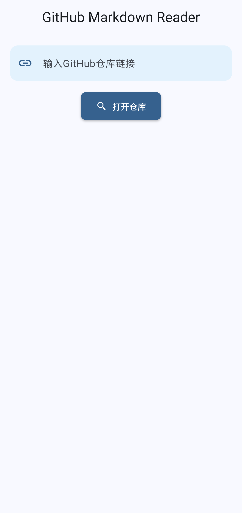

# GitMark - GitHub Markdown Reader

GitMark is a Flutter application that allows users to browse GitHub repositories and read Markdown files directly within the app. It's designed to provide a seamless experience for developers and documentation readers who want to explore markdown files in GitHub repositories.

| Light Theme | | | | |
| --- | --- | --- | --- | --- |
|  | | | | |

## Features

- **GitHub Repository Browser**: Enter any public GitHub repository URL to explore its contents
- **Branch Switching**: Easily switch between different branches of a repository
- **Markdown Rendering**: View markdown files with proper formatting and styling
- **LaTeX Support**: Render LaTeX mathematical formulas in markdown files
- **Image Control**: Option to enable/disable image loading in markdown files
- **Recent Repositories**: Quick access to recently visited repositories
- **File Navigation**: Browse through directories and files with an intuitive interface
- **Path Navigation**: Easy navigation through the repository file structure
- **Responsive Design**: Works on multiple screen sizes and supports both light and dark themes

## Getting Started

### Prerequisites

- Flutter SDK (version 3.7.0 or higher)
- Dart SDK (version 3.0.0 or higher)
- Any IDE with Flutter support (VS Code, Android Studio, etc.)

### Installation

1. Clone the repository:
   ```
   git clone https://github.com/yourusername/gitmark.git
   ```

2. Navigate to the project directory:
   ```
   cd gitmark
   ```

3. Install dependencies:
   ```
   flutter pub get
   ```

4. Run the app:
   ```
   flutter run
   ```

## Usage

1. Launch the app and enter a GitHub repository URL in the format: `https://github.com/username/repository`
2. The app will load the repository's default branch and display its contents
3. Navigate through directories by tapping on folder icons
4. View markdown files by tapping on markdown file icons (files with .md or .markdown extensions)
5. When viewing a markdown file:
   - Toggle images on/off using the image button in the app bar
   - Use the debug button for detailed information about the markdown content

## Dependencies

The app uses the following key dependencies:

- `dio`: For network requests to the GitHub API
- `provider`: For state management
- `flutter_markdown`: For rendering markdown content
- `flutter_math_fork`: For rendering mathematical formulas
- `shared_preferences`: For storing recent repositories and preferences
- `url_launcher`: For opening links
- `logging`: For application logging
- `flutter_markdown_latex`: For enhanced LaTeX support

## Project Structure

- `lib/models/`: Data models (Repository, ContentItem)
- `lib/providers/`: State management with ChangeNotifier
- `lib/services/`: API and storage services
- `lib/utils/`: Utility functions for parsing GitHub URLs
- `lib/views/`: Main application screens
- `lib/widgets/`: Reusable UI components
- `lib/app.dart`: Application theme and setup
- `lib/main.dart`: Application entry point

## Error Handling

GitMark includes comprehensive error handling for common issues:
- Network connectivity problems
- Invalid GitHub repository URLs
- API rate limits
- Missing or inaccessible content

## Configuration

### GitHub API Token (Optional)

To increase the GitHub API rate limit, you can add your GitHub token in the `GitHubService` class:

```dart
// In GitHubService class
void setToken(String token) {
  _dio.options.headers['Authorization'] = 'token $token';
}
```

## Contributing

Contributions are welcome! Please feel free to submit a Pull Request.

1. Fork the repository
2. Create your feature branch (`git checkout -b feature/amazing-feature`)
3. Commit your changes (`git commit -m 'Add some amazing feature'`)
4. Push to the branch (`git push origin feature/amazing-feature`)
5. Open a Pull Request

## License

This project is licensed under the MIT License - see the LICENSE file for details.

## Acknowledgements

- [Flutter](https://flutter.dev/) for the amazing framework
- [GitHub API](https://docs.github.com/en/rest) for providing access to repository data
- [flutter_markdown](https://pub.dev/packages/flutter_markdown) for excellent markdown rendering capabilities
- [flutter_math_fork](https://pub.dev/packages/flutter_math_fork) for LaTeX rendering support

---

Built with ❤️ by [Your Name]